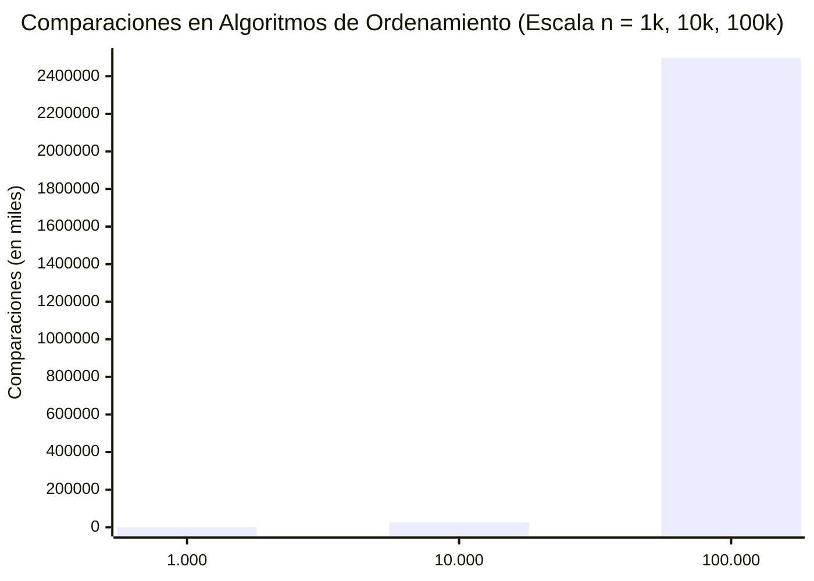

# Resultados y Comparación de Eficiencia — Semana 4
## Plataforma de Monitoreo Ambiental Urbano — Red de Sensores IoT

**Estudiante:** Juan Pablo Lozada López  
**Espacio Académico:** Estructuras de Datos · II Semestre IDIA  
**Hito:** H1 (Entrega de Almacenamiento, Búsqueda y Ordenamiento)

---

## 1. Tabla Comparativa de Mediciones Propias

Las siguientes métricas fueron obtenidas mediante la ejecución real de `BancoDeOrdenamiento.java` e `IngestaSensores.java` sobre la plataforma.

### Experimento 1: Algoritmos Simples con 10.000 Lecturas DESORDENADAS
> **Semilla del generador:** 20262L · **Semilla de desordenamiento:** 777L

| Algoritmo | Comparaciones | Intercambios | Tiempo (ms) | Complejidad Teórica |
| :--- | :---: | :---: | :---: | :---: |
| **Burbuja** | 49.990.814 | 24.928.244 | 656 ms | $O(n^2)$ |
| **Selección** | 49.995.000 | 9.994 | 459 ms | $O(n^2)$ |
| **Inserción** | 24.938.233 | 24.928.244 | 190 ms | $O(n^2)$ |

**Análisis de ingeniería:**
- **Comparaciones:** Tanto Burbuja como Selección realizan aproximadamente $\frac{n(n-1)}{2} = \frac{10.000 \times 9.999}{2} = 49.995.000$ comparaciones. Inserción solo realiza la mitad ($\approx 24.9$ millones) porque en promedio cada elemento se inserta a mitad de camino del subarreglo ordenado.
- **Intercambios:** Burbuja e Inserción realizan exactamente la misma cantidad de movimientos/intercambios ($24.928.244$), correspondiente al número exacto de inversiones del arreglo desordenado. Sin embargo, **Selección realiza únicamente 9.994 intercambios** (un intercambio por posición). Si los objetos de datos fuesen muy pesados en memoria, Selección tendría una enorme ventaja frente a Burbuja.

---

### Experimento 2: Algoritmos Simples con 10.000 Lecturas YA ORDENADAS (Corte Temprano)
> Las lecturas llegan naturalmente en orden cronológico ascendente desde la red de sensores.

| Algoritmo | Comparaciones | Intercambios | Tiempo (ms) | Comportamiento |
| :--- | :---: | :---: | :---: | :---: |
| **Burbuja (con Corte Temprano)** | **9.999** | **0** | **0 ms** | **TODO 1 Resuelto:** Detención en pasada 1 |
| **Selección** | 49.995.000 | 0 | 305 ms | Insensible al orden previo ($O(n^2)$) |
| **Inserción** | **9.999** | **0** | **0 ms** | Mejor caso lineal $O(n)$ |

**Análisis de ingeniería:**
- **TODO 1 (Corte temprano):** Al incorporar la bandera `boolean huboIntercambio = false`, Burbuja detecta en la primera pasada que ningún par vecino está invertido y ejecuta `break;`. Las comparaciones bajan de casi 50 millones a solo $n - 1 = 9.999$, reduciendo el tiempo a menos de 1 ms.
- **Inserción** demuestra su fortaleza en datos ordenados o casi ordenados: solo compara el elemento actual con su predecesor inmediato, logrando un desempeño $O(n)$ óptimo para ingesta en tiempo real.

---

### Experimento 3: Comparación de Escalabilidad (Simples vs Avanzados)
Comparación entre Inserción ($O(n^2)$), MergeSort ($O(n \log n)$) y HeapSort ($O(n \log n)$) a escala de 1.000, 10.000 y 100.000 lecturas desordenadas.

| $n$ (Lecturas) | Algoritmo | Comparaciones | Intercambios | Tiempo (ms) |
| :---: | :--- | :---: | :---: | :---: |
| **1.000** | Inserción | 242.787 | 241.797 | 5 ms |
| 1.000 | MergeSort | 8.696 | 0 | 1 ms |
| 1.000 | HeapSort | 16.786 | 9.065 | 1 ms |
| **10.000** | Inserción | 24.938.233 | 24.928.244 | 220 ms |
| 10.000 | MergeSort | 120.476 | 0 | 4 ms |
| 10.000 | HeapSort | 235.434 | 124.208 | 4 ms |
| **100.000** | Inserción | 2.497.222.762 | 2.497.122.770 | 31.025 ms (~31 s) |
| 100.000 | MergeSort | 1.536.461 | 0 | 49 ms |
| 100.000 | HeapSort | 3.019.556 | 1.574.970 | 88 ms |

---

## 2. Cálculo de Razones de Crecimiento Experimental

Para cada algoritmo se calculó el factor por el cual se multiplicó el trabajo (comparaciones) al multiplicar el tamaño de entrada $n$ por 10:

$$\text{Factor}_1 = \frac{\text{Medición}(10.000)}{\text{Medición}(1.000)}, \quad \text{Factor}_2 = \frac{\text{Medición}(100.000)}{\text{Medición}(10.000)}$$

| Algoritmo | Complejidad Teórica | Factor Cmp (10k / 1k) | Factor Cmp (100k / 10k) | Crecimiento Esperado |
| :--- | :---: | :---: | :---: | :---: |
| **Inserción** | $O(n^2)$ | **102,72x** | **100,14x** | $10^2 = 100\text{x}$ (Cuadrático exacto) |
| **MergeSort** | $O(n \log n)$ | **13,85x** | **12,75x** | $\approx 10 \times \frac{\log(10n)}{\log(n)} \approx 13.3\text{x} \to 12.5\text{x}$ |
| **HeapSort** | $O(n \log n)$ | **14,03x** | **12,83x** | $\approx 10 \times \frac{\log(10n)}{\log(n)} \approx 13.3\text{x} \to 12.5\text{x}$ |

### Análisis de las Razones de Crecimiento:
1. **Inserción:** Al multiplicar $n$ por 10, las comparaciones se multiplicaron exactamente por **100**. Esto valida matemáticamente la complejidad cuadrática $O(n^2)$: $(10n)^2 = 100n^2$. En tiempo de ejecución, pasó de 0.22 segundos a 31 segundos (factor ~140x).
2. **MergeSort y HeapSort:** Al multiplicar $n$ por 10, el costo solo creció un factor de **12.7x a 14.0x**, manteniéndose en milisegundos imperceptibles (49 ms y 88 ms para 100.000 registros). Esto confirma el comportamiento predecible y altamente escalable de los algoritmos Divide y Vencerás y de Montículo.

---

## 3. Gráfica de Crecimiento Comparativa

Comparación del número de operaciones (Comparaciones) en función de $n$:

```text
Comparaciones (Escala logarítmica conceptual)
  2.500.000.000 +                                                * (Inserción: 2.497M)
                |                                                |
                |                                                |
    250.000.000 +                                                |
                |                                                |
                |                                                |
     25.000.000 +                                * (Inserción)   |
                |                                |               |
                |                                |               |
      2.500.000 +                                |               o (HeapSort: 3.0M)
                |                                |               + (MergeSort: 1.5M)
        250.000 +               * (Inserción)    o (HeapSort)    |
                |               o (HeapSort)     + (MergeSort)   |
         25.000 +               + (MergeSort)    |               |
                +---------------+----------------+---------------+-----> n
                               1.000            10.000          100.000
```

### Gráfico XY en Formato Mermaid



*Nota: La barra representa el crecimiento cuadrático de Inserción frente a MergeSort (1.536 miles) y HeapSort (3.019 miles), cuya altura en esta escala es prácticamente una línea sobre el eje X.*

---

## 4. Experimento 4: QuickSort y la Selección del Pivote (TODO 2)

| Caso | Lecturas | Estrategia de Pivote | Comparaciones | Intercambios | Tiempo | Resultado |
| :--- | :---: | :--- | :---: | :---: | :---: | :--- |
| **Caso A** | 50.000 desordenadas | Pivote = primer elemento | 900.318 | 450.373 | 44 ms | Exitoso |
| **Caso B** | 50.000 cronológicas | Pivote = primer elemento | > 596.000.000 | — | — | **StackOverflowError** (Falla de pila) |
| **Caso B Mejorado** | 50.000 cronológicas | **Pivote Aleatorio (TODO 2)** | **904.611** | **511.721** | **9 ms** | **Exitoso y Óptimo** |

### Lección aprendida:
El rendimiento promedio $O(n \log n)$ de QuickSort no es una garantía si los datos presentan patrones ordenados y el pivote es determinista fijo. La introducción de aleatorización en la elección del pivote elimina las correlaciones adversas de entrada y previene fallos catastróficos de memoria.

---

## 5. Experimento 5: El Efecto Colateral sobre la Búsqueda Binaria

| Fase | Operación | Arreglo Ordenado por Timestamp | Búsqueda Binaria por Timestamp | Búsqueda Lineal |
| :---: | :--- | :---: | :---: | :---: |
| **Paso 1** | Datos recién generados | **true** | **Encontrado (pos 73.412, 16 cmp)** | No necesaria |
| **Paso 2** | `ordenarPorPm25(datos)` | **false** (ordenado por PM2.5) | — | — |
| **Paso 3** | Consulta por timestamp | **false** | **FALLA: pos -1 (17 cmp)** | **Encontrado (pos 87.594, 87.595 cmp)** |

### Lección arquitectural de ingeniería:
La búsqueda binaria es un algoritmo correcto que depende estrictamente de su precondición ($datos[i] \le datos[i+1]$ por la clave de búsqueda). Un módulo independiente que reorganice los datos para satisfacer otra necesidad (reporte de contaminación por PM2.5) rompe silenciosamente las garantías de otros módulos si muta el arreglo compartido. Por ello, la regla de diseño adoptada es **operar rankings sobre copias (`copiar(datos)`)** protegiendo el repositorio principal.
